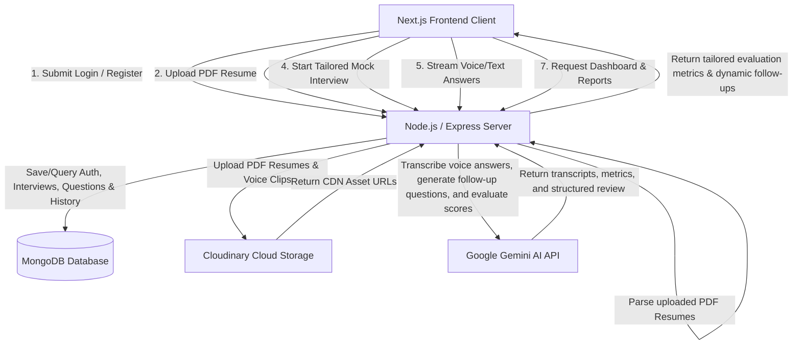
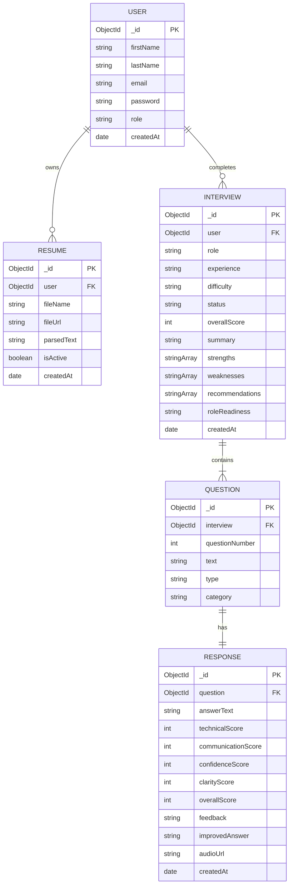

# PrePrep 🚀 (AI Mock Interview Coach)

PrePrep is a premium, full-stack AI-powered mock interview coach designed to help candidates prepare for technical, behavior, and industry-specific interviews. By parsing candidate resumes, the engine generates tailored questions, handles audio/voice recordings, transcribes answers using Gemini AI, conducts follow-up questions dynamically based on previous responses, and presents high-fidelity results with deep analytical breakdowns.

---

## 🛠️ Tech Stack

### Frontend
- **Framework**: Next.js (App Router, Client & Server Components)
- **Styling**: Vanilla CSS with custom utility tokens (Custom Glassmorphism, animations, layouts)
- **Icons**: Lucide Icons
- **State & Routing**: React hooks, Next.js routing (including Suspense boundary support)
- **Audio Recording**: Web Audio API (MediaRecorder)

### Backend
- **Runtime**: Node.js & Express
- **Database**: MongoDB (Mongoose ORM)
- **AI Integrations**: Google Generative AI SDK (Gemini Pro & Gemini Flash 2.0)
- **File Storage**: Cloudinary (for resumes and audio response uploads)
- **Text Extraction**: `pdf-parse` (for parsing resume files)
- **Security**: Helmet, dynamic CORS verification, cookies with custom `sameSite` & `secure` configurations.

---

## 🏗️ Architecture Diagram

Below is the high-level architecture diagram detailing the flows between the client, backend server, database, and third-party APIs:



---

## 🗄️ Entity-Relationship (ER) Diagram

The following diagram defines the structure of the database collections and relationships:



---

## 🔌 API Documentation

### Authentication Routes

| Method | Endpoint | Description | Access |
|---|---|---|---|
| `POST` | `/api/auth/register` | Register a new user account | Public |
| `POST` | `/api/auth/login` | Login and set authorization cookies | Public |
| `POST` | `/api/auth/logout` | Clear user session cookies | Private |
| `GET` | `/api/auth/me` | Fetch active user credentials | Private |

### Resume Routes

| Method | Endpoint | Description | Access |
|---|---|---|---|
| `GET` | `/api/resumes` | Retrieve all resumes uploaded by the user | Private |
| `POST` | `/api/resumes/upload` | Upload new PDF resume, extract text, and save details | Private |
| `PUT` | `/api/resumes/:id/active` | Toggle designated resume active to tailor interview questions | Private |
| `DELETE` | `/api/resumes/:id` | Remove a resume from database and Cloudinary storage | Private |

### Interview Routes

| Method | Endpoint | Description | Access |
|---|---|---|---|
| `POST` | `/api/interviews` | Create interview parameters (role, difficulty, experience) | Private |
| `GET` | `/api/interviews/:id` | Fetch complete interview session details, questions, and responses | Private |
| `DELETE` | `/api/interviews/:id` | Permanently delete an interview session and logs | Private |

### Response & Transcription Routes

| Method | Endpoint | Description | Access |
|---|---|---|---|
| `POST` | `/api/responses/submit` | Submit text or audio response, request transcription/analysis, and update dynamic follow-ups | Private |

### Analytics & History Routes

| Method | Endpoint | Description | Access |
|---|---|---|---|
| `GET` | `/api/analytics/dashboard` | Fetch dashboard stats, average scores, and recent sessions | Private |
| `GET` | `/api/analytics/history` | Fetch complete paginated interview history | Private |

---

## 📸 Screenshots Guide

To showcase this application in your portfolio, take screenshots of the following pages:
1. **Dynamic Dashboard**: Highlighting stats cards, average interview progress line chart, recent activity rows, and the AI tailored suggestion cards.
2. **Audio Mock Interview Session (Voice Mode)**: Showcasing the voice mode wave activity bar, interactive microphone controls, elapsed timer, and live question prompt cards.
3. **Key Summary & Results Screen**: Exhibiting overall circular score charts, readiness categories, strengths/weaknesses grids, and recommendations.
4. **Interactive Detailed Feedback Breakdown**: Showing the sidebar question tab list and full evaluation card (including user answer, improved answer, transcription audit, and audio playback bar).
5. **Resume Profile Board**: Highlighting PDF upload drop zone cards, active resume selectors, and Cloudinary PDF links.

---

## 📹 Demo Video Flow Script

Capture a **1.5 to 2 minute walkthrough video** following this structured flow:
1. **Introduction (15s)**: Start on the dashboard page. Show your user stats, history trends, and the core intent of the app.
2. **Resume Matching (20s)**: Go to the profile page. Upload a PDF resume, show the success toast, and toggle it as the active resume.
3. **Interview Configuration (20s)**: Start a new interview. Select role settings (e.g. Frontend Engineer), select difficulty, and check the setup.
4. **Voice Mock Interview (30s)**: Answer the first question using **Voice Mode**. Record audio, click submit, and watch the dynamic follow-up question generate based on your voice answer.
5. **Detailed Evaluation (35s)**: Conclude the interview, redirect to the results page, showing the circular score gauges. Open the detailed feedback tab, play your recorded audio back, compare your answer against the AI-improved version, and print the complete report (`window.print()`).

---

## 📄 Resume Description Entry

Add this entry to your software engineer resume:

> **AI Mock Interview Coach (PrePrep) | Full-Stack Developer**
> - Architected a premium full-stack responsive web application that tailors behavioral and technical interview prep using Gemini AI models.
> - Structured an asynchronous AI pipeline converting browser-recorded voice answers (`audio/webm` container) to high-fidelity text transcripts via multimodal Gemini endpoints, saving audio clips to Cloudinary.
> - Integrated `pdf-parse` in Node.js to extract structural text from uploaded PDF resumes, utilizing dynamic context parameters to personalize technical interview questions.
> - Developed a client-side audio feedback player and print engine (`window.print()`) that renders complete interview evaluation reports dynamically.
> - Built a robust dashboard containing line-graph trend analytics, pagination, skeletons, custom toast notifications, and secure HTTP-only cookies.

---

## 💼 LinkedIn Announcement Post

Use this template to share your work on LinkedIn:

```text
🚀 Excited to share my latest project: PrePrep - an AI-powered Mock Interview Coach!

PrePrep is a web application designed to help software engineers and technical professionals prepare for mock interviews. It doesn't just ask generic questions—it tailors your prep to your real experience!

Key features:
🎤 Dynamic Voice Mode: Record spoken answers directly. The app uploads the voice notes, uses Gemini Flash to transcribe and analyze them, and lets you play back your recordings in the feedback session.
📄 Resume Customization: Upload your PDF resume. The backend parses your skills and matches interview questions exactly to your expertise.
🔄 Adaptive Follow-ups: The AI analyzes your previous response on the fly to generate realistic follow-up questions.
📊 In-depth Diagnostics: Full category scores (Technical, Communication, Confidence, Clarity) accompanied by custom charts, AI-suggested answers, strengths, weaknesses, and a printable PDF report.

Check out the architecture and code here: [Your Repo Link]

#nextjs #nodejs #mongodb #generativeai #softwaredevelopment #fullstack #portfolio
```
